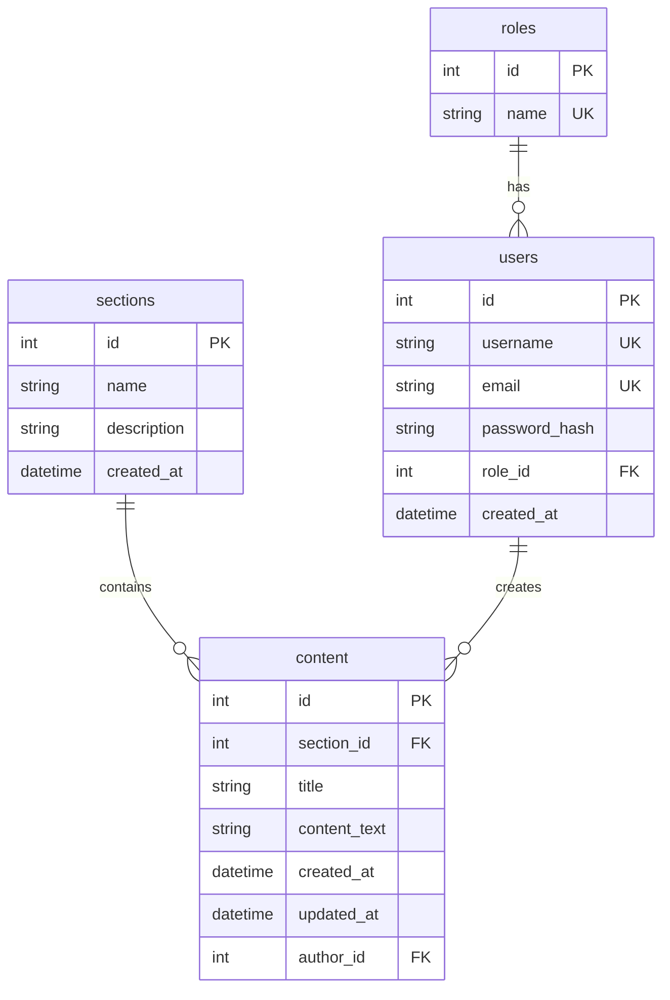

# Схема базы данных

## Описание связей:

- **roles → users**: Один ко многим (ON DELETE RESTRICT)
  - Одна роль может принадлежать многим пользователям
  - Удаление роли запрещено, если есть пользователи с этой ролью

- **sections → content**: Один ко многим (ON DELETE CASCADE)
  - Один раздел может содержать много контента
  - При удалении раздела удаляется весь связанный контент

- **users → content**: Один ко многим (ON DELETE SET NULL)
  - Один пользователь может создать много контента
  - При удалении пользователя author_id устанавливается в NULL

